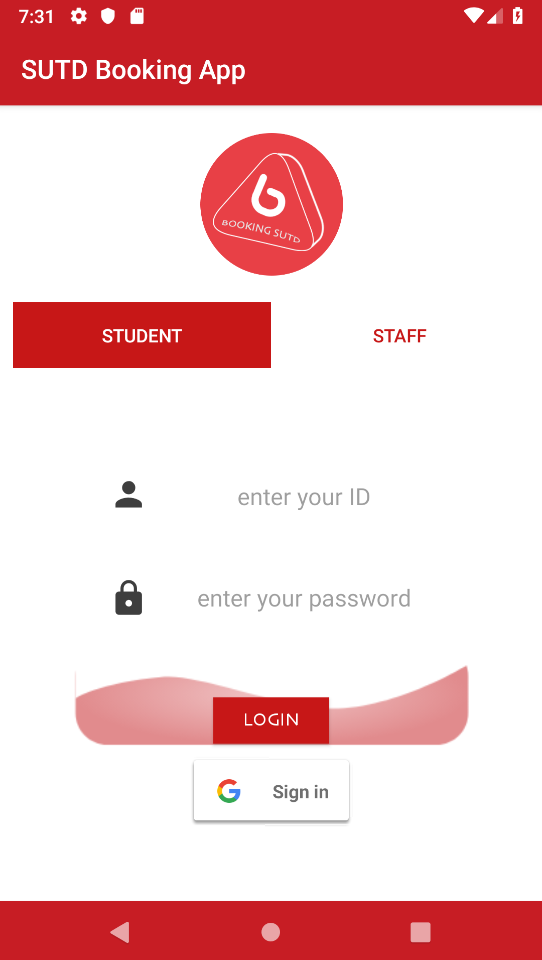
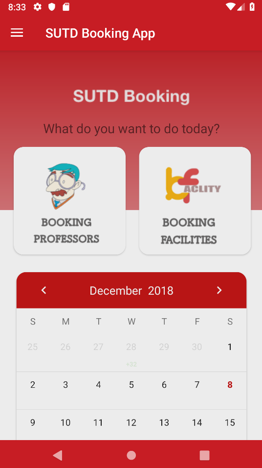
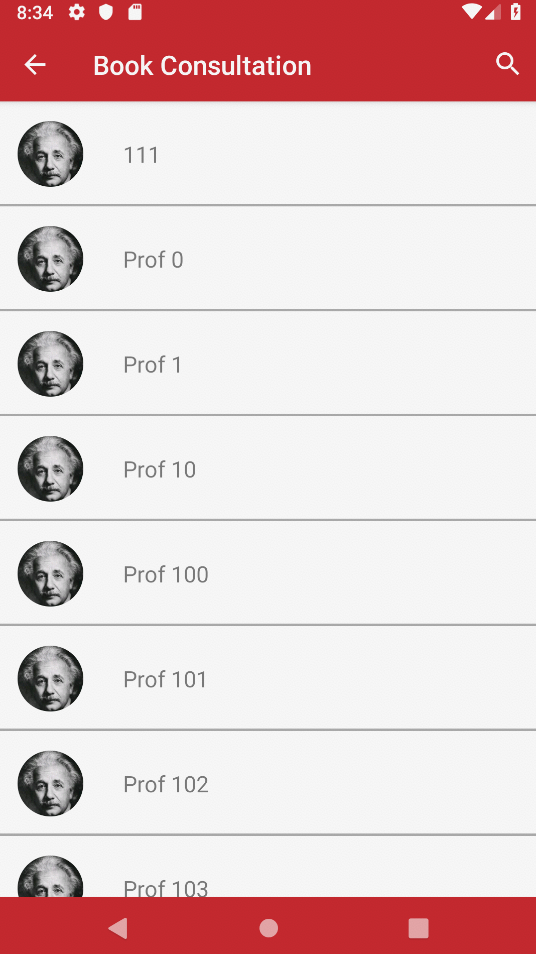
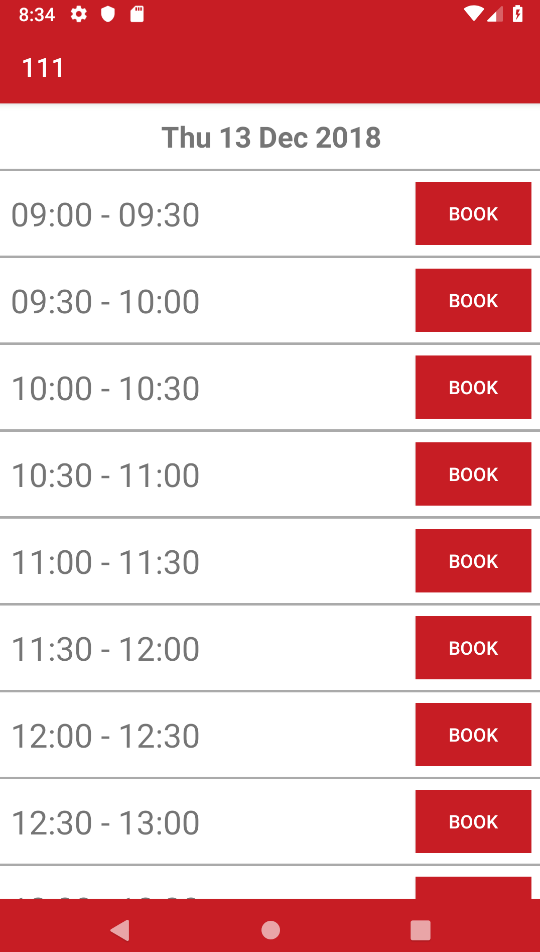
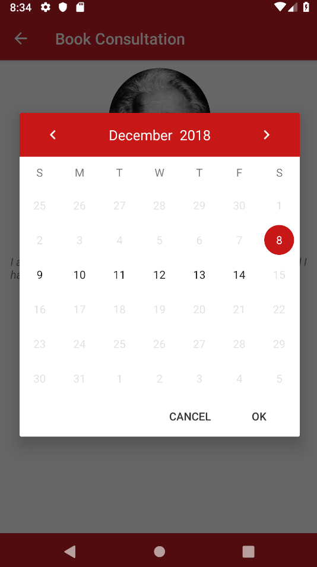
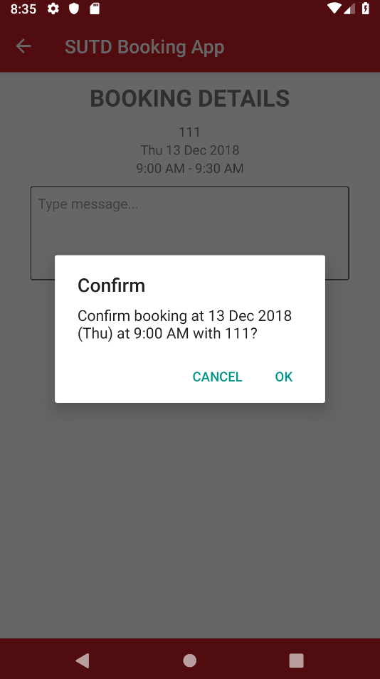
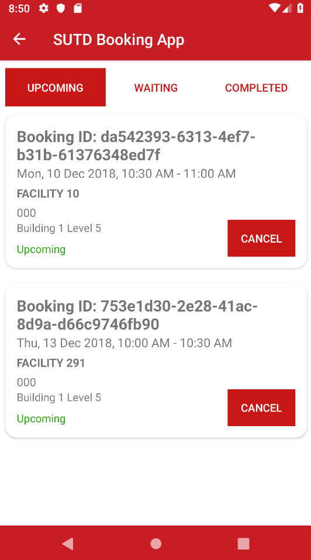
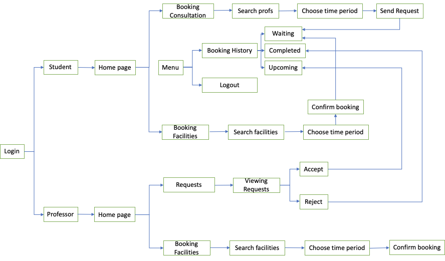

# SUTD Booking App

One Stop Booking application for student in SUTD

## UI

  
  
  
  
  
  
  

## Features

Students:
- Booking People: professors, staffs, CDC staffs
- Booking Facilities:  meeting rooms, laser machine, fablab, etc

In student version, students can book school facilities and send request for consult with prof or other staff within one week. 

Professors:
- Requests: student meeting requests
- Booking facilities: meeting rooms, laser machine, fablab, etc

In prof version, prof also can book the school facilities like students. Instead of sending requests, profs can check the requests that they have received and accept or decline the requests flexibly.

## App Flow

  

## Technology

1. [DynamoDB][1]

## Open Source
1. [Glide][2]
2. [MaterialCalendarView][3]

## Team
- Ivan Christian
- James Andrew Pohadi
- Gou Yuanyuan
- Rachel Chua
- Shanjay Shankar
- Wang Zijia

[1]: https://aws.amazon.com/dynamodb/
[2]: https://github.com/bumptech/glide
[3]: https://github.com/Applandeo/Material-Calendar-View
